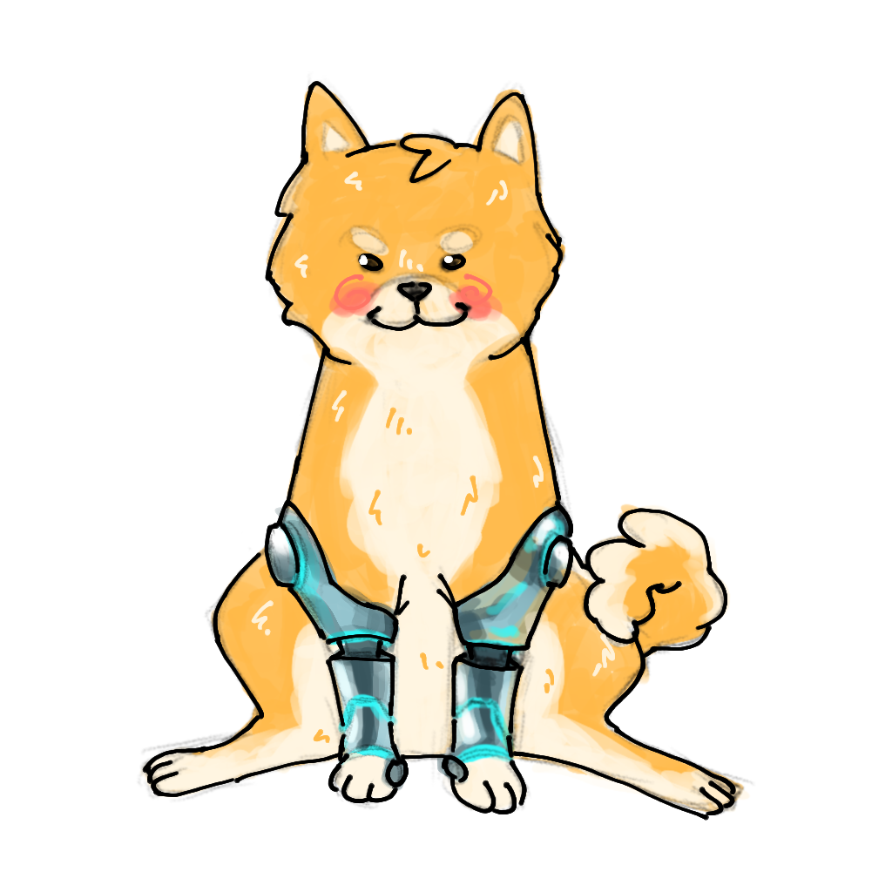
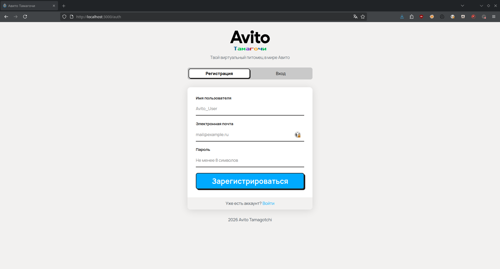
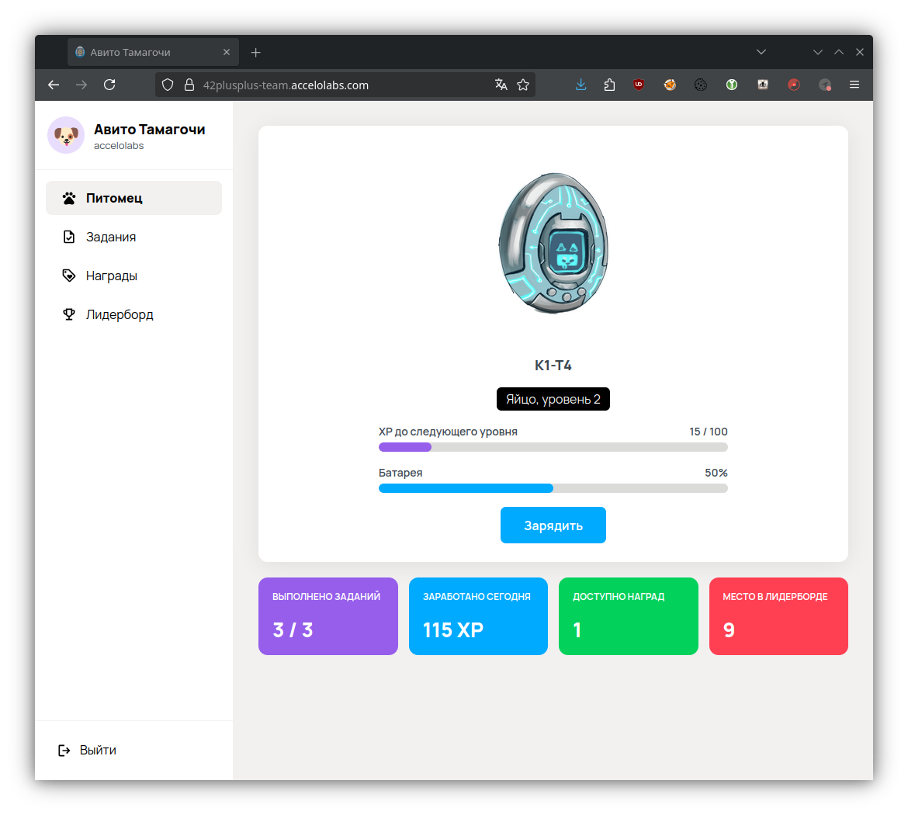
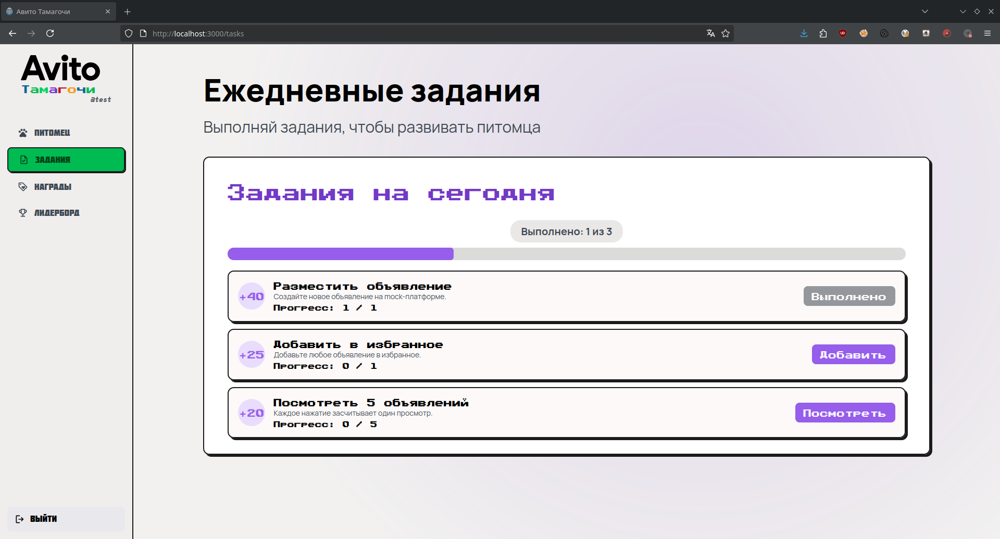
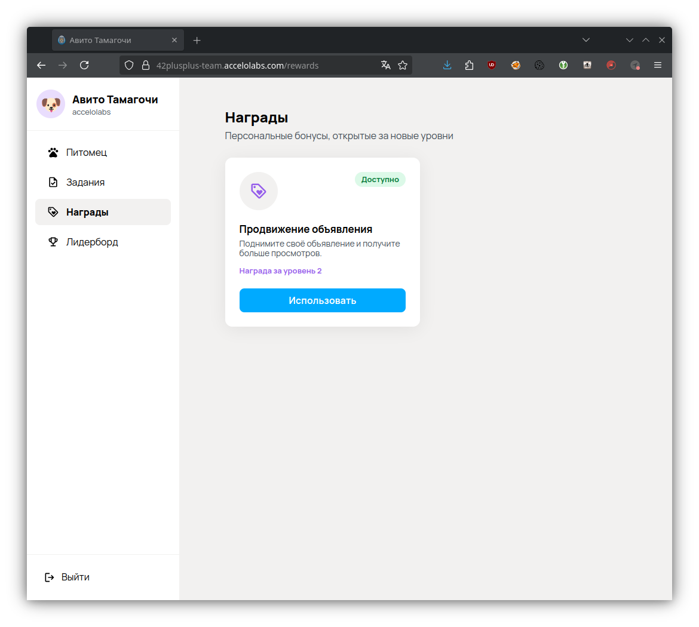
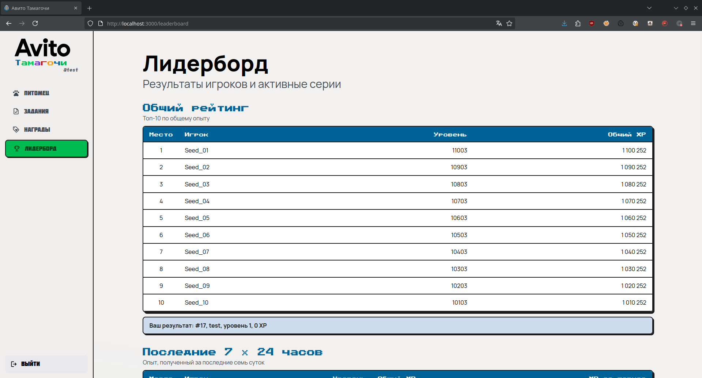

# Авито Тамагочи

<p align="center">
  
</p>

MVP виртуального питомца: действия пользователя дают XP, повышают уровень и открывают персональные бонусы.

## Сценарий

1. Пользователь регистрируется и получает сессию.
2. При первом открытии главной страницы создаётся питомец.
3. Ежедневная зарядка увеличивает серию и дневную XP-награду.
4. Зарядка и задания начисляют XP, а новые уровни открывают награды.
5. Сводка и четыре лидерборда показывают изменения.
6. Через 48 часов без зарядки питомец умирает и теряет текущий прогресс.

Правила: [docs/game-design.md](docs/game-design.md). API: [api/openapi.yaml](api/openapi.yaml).

## Стек

- React 19, TypeScript, Vite, ESLint;
- Go 1.26, `net/http`;
- PostgreSQL 18;
- Docker Compose и Caddy.

PostgreSQL — единственный источник истины. Изменения XP, заданий и наград защищены транзакциями и ограничениями БД.

## Структура проекта

- `backend/cmd` — API и миграции;
- `backend/internal` — auth, игровые домены, realtime и инфраструктура;
- `backend/migrations` — схема и ограничения PostgreSQL;
- `frontend/src` — React-приложение и страницы;
- `api` — OpenAPI-контракт;
- `docs` — игровой дизайн, API, описание тестирования.

История коммитов доступна в [GitHub-репозитории](https://github.com/accelolabs/avito-tamagochi).

## Особенности реализации

- Backend — единственный источник расчёта XP, уровней и наград.
- Изменения состояния выполняются транзакционно в PostgreSQL.
- Ограничения БД предотвращают повторное начисление XP и использование награды.
- После изменений frontend получает WebSocket-событие и обновляет данные через API.

## Запуск

Нужны Docker и Docker Compose.

```bash
cp .env.example .env
docker compose up --build
```

- Локально: <http://localhost:3000>
- Production: <https://42plusplus-team.accelolabs.com>

```bash
docker compose down
```

### Тестовые лидерборды

После запуска приложения отдельная команда создаёт или обновляет десять служебных пользователей для общего, недельного, месячного и streak-лидербордов:

```bash
docker compose run --rm seed
```

Команда не запускается автоматически и не изменяет обычных пользователей.

### HTTPS на домене

```dotenv
SITE_ADDRESS=tamagochi.example.ru
FRONTEND_PORT=80
FRONTEND_HTTPS_PORT=443
APP_SECURE_COOKIES=true
```

DNS должен указывать на сервер. Откройте TCP `80`, TCP `443` и UDP `443`. Caddy получает TLS-сертификат и хранит его в `caddy_data`.

## Проверки

```bash
cd backend && go test ./...
cd backend && golangci-lint run --config ../.golangci.yml ./...
cd frontend && npm run lint && npm run build
docker compose config --quiet
```

CI использует `golangci-lint` версии `v2.10.1`. PostgreSQL integration-тесты запускаются отдельно: [docs/testing.md](docs/testing.md).

## Ограничения MVP

- Caddy — единственная публичная точка входа.
- HTTP API доступен под `/api/v1`, WebSocket — под `/ws`.
- Интеграции с Авито и применение бонусов заменены mock-операциями.
- Нет Redis, очередей, cron, резервного копирования и production-мониторинга.

## Использование ИИ

ИИ использовался для анализа требований, планирования реализации и написания кода в соответствии с заданными спецификациями. Также он применялся для подготовки тестов и проверки согласованности API и документации. Все результаты дополнительно проверялись автоматическими тестами и сборкой проекта.

## Документация

- [Исходный кейс](docs/Кейс%201.pdf)
- [Игровой дизайн](docs/game-design.md)
- [Игровой API](docs/game-api.md)
- [Тестирование](docs/testing.md)

## Индвидуальный вклад участников.
**iconfire7 (Амин) [Репозиторий](https://github.com/iconfire7/avito-iconfire7)** - Разработал модули аутентификации и сессий, включая регистрацию, вход, безопасность и PostgreSQL-репозитории, реализовал WebSocket-взаимодействие и миграции таблиц пользователей и сессий.

**Alexandra-Vikhareva (Александра)** - Разработала дизайн интерфейса и маскота проекта, полностью реализовала frontend на React и TypeScript, включая страницы авторизации, питомца, заданий, наград и лидерборда.

**accelolabs (Даниил) [Репозиторий](https://github.com/accelolabs/avito-accelolabs)** - Разработал игровую backend-часть проекта: питомца, XP, уровни и стадии, задания, награды, сводку и лидерборд, подключил готовый WebSocket к игровым изменениям, реализовал PostgreSQL-миграции, настроил Docker/Caddy и деплой, OpenAPI, тесты, линтер и проектную документацию.

**Kartoshkasmyasom (Анастасия)** - Настроила CI и добавила тесты, проверяющие откат изменений в базе данных при возникновении ошибок.

## Скриншоты

### Авторизация

<p align="center">
  
</p>

### Питомец

<p align="center">
  
</p>

### Задания

<p align="center">
  
</p>

### Награды

<p align="center">
  
</p>

### Лидерборд

<p align="center">
  
</p>
