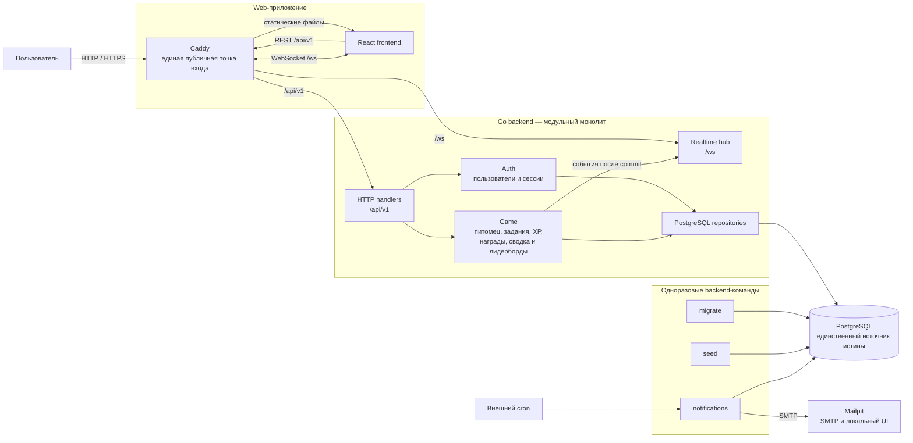
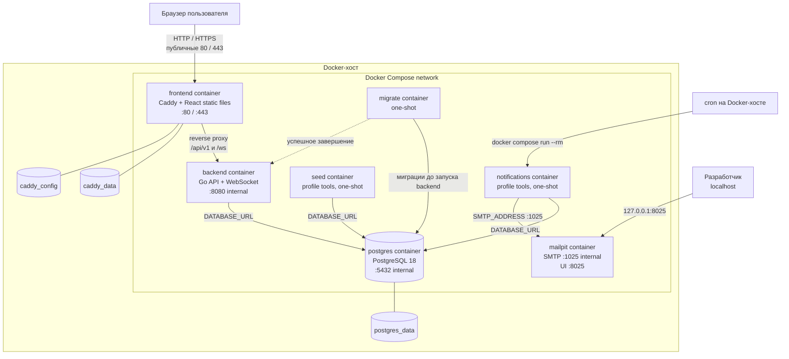

# Архитектура

## Диаграмма компонентов

Backend остаётся единым процессом: `auth`, игровые модули и `realtime` не являются
отдельными сервисами. XP, уровни и награды рассчитываются только в backend, а
изменения игрового состояния защищаются транзакциями и ограничениями PostgreSQL.

## Диаграмма развёртывания

Caddy — единственная публичная точка входа приложения. `backend` и PostgreSQL
доступны только внутри Compose-сети. Mailpit UI публикуется исключительно на
`127.0.0.1`, а `migrate`, `seed` и `notifications` завершаются после выполнения.
